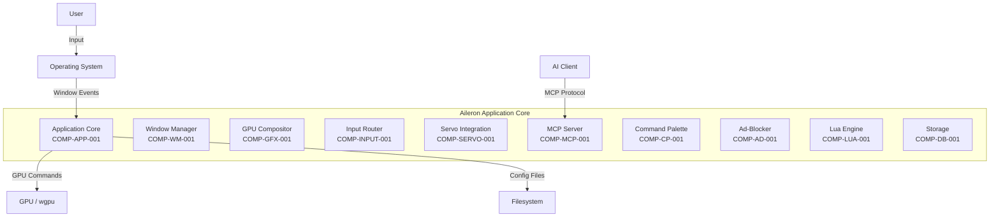
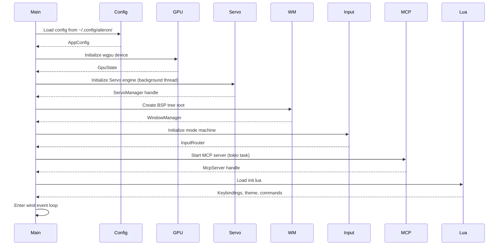
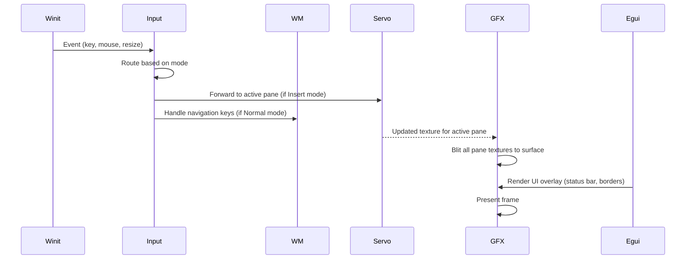

# BP-APP-CORE-001: Application Core & Main Loop

## BP-1: Design Overview

### System Purpose
The Application Core orchestrates all Aileron subsystems. It owns the main event loop (via winit), manages application lifecycle (init, run, shutdown), and coordinates message passing between the UI thread, Servo background threads, and tokio async tasks.

### System Scope

| In Scope | Out of Scope |
|----------|--------------|
| Application initialization & shutdown | Individual component internals |
| Main event loop management | Platform-specific window creation details |
| Inter-component message routing | Network protocol implementation |
| Configuration loading | Lua script parsing |

### Stakeholder Identification

| Stakeholder | Role | Concerns | Priority |
|-------------|------|----------|----------|
| End users | Primary | Startup time, stability, graceful shutdown | H |
| Developers | Contributors | Clean architecture, extensibility | H |
| OS | Platform | Resource cleanup on exit | M |

### Design Viewpoints

| Viewpoint | Purpose | Stakeholders |
|-----------|---------|--------------|
| Context | System boundaries, external dependencies | All |
| Decomposition | Component structure | Architects |
| Interface | Inter-component APIs | Developers |

### System Context Diagram



## BP-2: Design Decomposition

### Component Registry

| Attribute | Value |
|-----------|-------|
| ID | COMP-APP-001 |
| Name | Application Core |
| Type | Module |
| Responsibility | Orchestrate all subsystems, manage main event loop and application lifecycle |

### Dependencies

| Dependency | Type | Version | Purpose |
|------------|------|---------|---------|
| COMP-WM-001 | Internal | 0.1.0 | Tiling layout |
| COMP-GFX-001 | Internal | 0.1.0 | GPU rendering |
| COMP-INPUT-001 | Internal | 0.1.0 | Event routing |
| COMP-SERVO-001 | Internal | 0.1.0 | Web rendering |
| COMP-MCP-001 | Internal | 0.1.0 | AI integration |
| COMP-CP-001 | Internal | 0.1.0 | Command palette |
| COMP-AD-001 | Internal | 0.1.0 | Ad blocking |
| COMP-LUA-001 | Internal | 0.1.0 | Scripting |
| COMP-DB-001 | Internal | 0.1.0 | Storage |
| winit | External | 0.30 | Windowing |
| tokio | External | 1.x | Async runtime |
| tracing | External | 0.1 | Logging |
| anyhow | External | 1.x | Error handling |

### Coupling Metrics

| Metric | Value | Threshold | Status |
|--------|-------|-----------|--------|
| Afferent Coupling (Ca) | 0 | < 10 | PASS |
| Efferent Coupling (Ce) | 9 | < 15 | PASS |
| Instability | 1.0 | 0.3-0.7 | HIGH (expected for core) |

## BP-3: Design Rationale

**Context:** The main loop must coordinate synchronous (winit events, egui rendering) and asynchronous (Servo, MCP, network) operations.

**Decision:** Use winit's event loop on the main thread for UI rendering, with tokio runtime on a background thread for async operations. Communicate via crossbeam channels.

**Alternatives:**

| Alternative | Pros | Cons | Reason Rejected |
|-------------|------|------|-----------------|
| All async (winit+tokio on same thread) | Simpler message passing | winit event loop is synchronous; would require `pollster` or `block_on` which can deadlock | Complexity outweighs benefit |
| Separate process for Servo | True isolation | IPC overhead, complex serialization | Overkill for single-binary architecture |

## BP-4: Traceability

| Requirement ID | Component ID | Interface ID | Test Case ID | Yellow Paper Ref |
|----------------|--------------|--------------|--------------|------------------|
| REQ-GFX-001 | COMP-APP-001 | IF-APP-INIT-001 | TC-INIT-001 | YP-GFX-COMPOSITE-001 |
| REQ-GFX-005 | COMP-GFX-001 | IF-GFX-COMPOSITE-001 | TC-FPS-001 | YP-GFX-COMPOSITE-001 THM-GFX-001 |
| REQ-MODE-001 | COMP-INPUT-001 | IF-INPUT-MODE-001 | TC-MODE-001 | YP-INPUT-MODES-001 THM-MODE-001 |
| REQ-WM-001 | COMP-WM-001 | IF-WM-TREE-001 | TC-BSP-001 | YP-WM-BSP-001 THM-BSP-001 |

## BP-5: Interface Design

### IF-APP-INIT-001: Application Initialization

**Version:** 1.0.0 | **Provider:** COMP-APP-001 | **Consumers:** All components

```rust
// Signature
fn initialize(config_path: &Path) -> Result<AppState, InitError>
```

**Preconditions:**

| ID | Condition | Enforcement | Error if Violated |
|----|-----------|-------------|-------------------|
| PRE-INIT-001 | Config directory exists or is creatable | Create via `directories` crate | INIT_ERROR_CONFIG |
| PRE-INIT-002 | GPU device available | wgpu::Instance::create | INIT_ERROR_NO_GPU |
| PRE-INIT-003 | Filter list files readable | fs::read | INIT_ERROR_FILTERS |

**Postconditions:**

| ID | Condition | Verification |
|----|-----------|--------------|
| POST-INIT-001 | winit window created and visible | Window handle check |
| POST-INIT-002 | wgpu device and queue initialized | Device handle non-null |
| POST-INIT-003 | All subsystems initialized | Component health check |

**Error Handling:**

| Error Code | Condition | Recovery |
|------------|-----------|----------|
| INIT_ERROR_NO_GPU | No compatible GPU found | Log error, suggest drivers, exit |
| INIT_ERROR_CONFIG | Config directory inaccessible | Fall back to defaults |
| INIT_ERROR_SERVO | Servo engine fails to init | Log error, enter degraded mode |

### IF-APP-LIFECYCLE-001: Main Loop

```rust
// Signature
fn run(app_state: AppState) -> Result<(), RunError>
```

**Thread Safety:** Not thread-safe (main thread only)
**Complexity:** Time: $O(n)$ per frame where $n$ = active panes | Space: $O(1)$ per frame

## BP-6: Data Design

### AppState

| Attribute | Value |
|-----------|-------|
| Name | AppState |
| Type | Struct |
| Fields | window: WinitWindow, gpu: GpuState, wm: WindowManager, input: InputRouter, servo: ServoManager, mcp: McpServer, config: AppConfig, db: Database |
| Thread Safety | Interior mutability via Mutex/RwLock for shared fields |

## BP-7: Component Design

### Initialization Sequence



### Per-Frame Loop



## BP-8: Deployment Design

### Resource Requirements

| Resource | Minimum | Recommended | Peak | Source |
|----------|---------|-------------|------|--------|
| CPU | 2 cores | 4 cores | 8 cores | Servo multi-threading |
| RAM | 512 MB | 1 GB | 2 GB | Servo + textures + filter lists |
| GPU VRAM | 256 MB | 512 MB | 1 GB | Pane textures at 4K |
| Disk | 50 MB | 100 MB | 500 MB | Binary + filter lists + DB |

## BP-9: Formal Verification

| Property ID | Description | Method | Priority | Status |
|-------------|-------------|--------|----------|--------|
| PROP-APP-001 | Initialization completes without panic | Unit test | Critical | PENDING |
| PROP-APP-002 | Graceful shutdown releases all resources | Valgrind leak check | Critical | PENDING |
| PROP-APP-003 | Event loop handles all event types | Exhaustive match test | High | PENDING |

## BP-10: HAL Specification
Not applicable (uses winit/wgpu abstractions).

## BP-11: Compliance Matrix

| Standard | Clause | Requirement | Implementation | Status |
|----------|--------|-------------|----------------|--------|
| IEEE 1016 | 5.1-5.8 | Design Description | This document | COMPLIANT |
| ISO/IEC 12207 | 6.1 | Project Planning | Phase-based R&D cycle | COMPLIANT |

## BP-12: Quality Checklist

- [x] BP-1: Design Overview complete
- [x] BP-2: Design Decomposition complete
- [x] BP-3: Design Rationale complete
- [x] BP-4: Traceability complete
- [x] BP-5: Interface Design complete
- [x] BP-6: Data Design complete
- [x] BP-7: Component Design complete
- [x] BP-8: Deployment Design complete
- [x] BP-9: Formal Verification specified
- [x] BP-10: HAL N/A
- [x] BP-11: Compliance Matrix complete
- [x] BP-12: Quality Checklist complete
