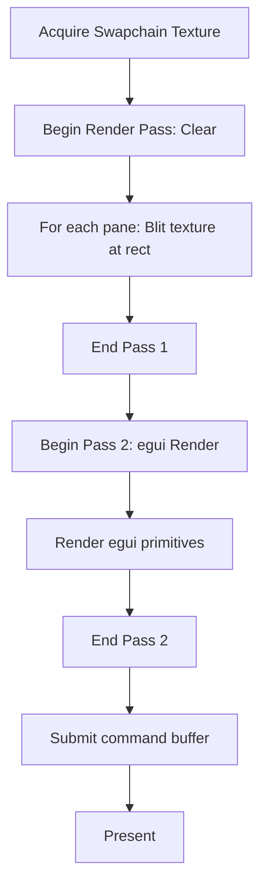

# BP-GFX-COMPOSITOR-001: GPU Compositor

## BP-1: Design Overview

### System Purpose
Composites Servo-rendered pane textures and egui UI overlays onto a single wgpu swapchain surface. Manages texture creation, lifetime, and the per-frame render graph.

### System Scope

| In Scope | Out of Scope |
|----------|--------------|
| Texture creation/destruction | Shader post-processing |
| Per-frame compositing | HDR rendering |
| Swapchain management | Multi-monitor spanning |
| egui integration | Custom rendering shaders |

## BP-2: Design Decomposition

| Attribute | Value |
|-----------|-------|
| ID | COMP-GFX-001 |
| Name | GPU Compositor |
| Type | Module |
| Responsibility | Manage GPU rendering pipeline |

### Rust Module Structure

```
src/gfx/
├── mod.rs           // Public API
├── state.rs         // GpuState (device, queue, surface)
├── texture.rs       // Pane texture pool
├── compositor.rs    // Frame compositing logic
└── egui_renderer.rs // egui-wgpu integration
```

## BP-3: Design Rationale

**Context:** Need to render both Servo web content and egui UI on the same GPU surface.

**Decision:** Use a two-pass render graph:
1. Pass 1: Blit Servo textures at BSP-computed rectangle positions
2. Pass 2: Render egui primitives (borders, status bar, command palette) on top

This avoids expensive read-back or CPU-side compositing.

## BP-4: Traceability

| Requirement ID | Component ID | Yellow Paper Ref |
|----------------|--------------|------------------|
| REQ-GFX-002 | COMP-GFX-001 | YP-GFX-COMPOSITE-001 ALG-GFX-002 |
| REQ-GFX-003 | COMP-GFX-001 | YP-GFX-COMPOSITE-001 AX-GFX-001 |
| REQ-GFX-005 | COMP-GFX-001 | YP-GFX-COMPOSITE-001 THM-GFX-001 |

## BP-5: Interface Design

### IF-GFX-COMPOSITE-001: Frame Compositing

```rust
fn composite_frame(
    &mut self,
    pane_textures: &[(Uuid, &wgpu::TextureView)],
    pane_rects: &[(Uuid, Rect)],
    egui_clipped_primitives: &[egui::ClippedPrimitive],
    egui_textures_delta: &egui::TexturesDelta,
) -> Result<(), CompositorError>;
```

**Preconditions:**

| ID | Condition | Enforcement |
|----|-----------|-------------|
| PRE-GFX-001 | Swapchain texture acquired | wgpu::Surface::get_current_texture |
| PRE-GFX-002 | All pane textures valid (non-destroyed) | Texture pool validation |
| PRE-GFX-003 | Pane count <= 16 | Assert |

**Postconditions:**

| ID | Condition | Verification |
|----|-----------|--------------|
| POST-GFX-001 | Frame presented to swapchain | Present callback |
| POST-GFX-002 | Frame time < 16.67ms | GPU timer query |

**Complexity:**

| Metric | Value | Derivation |
|--------|-------|------------|
| Time (GPU) | $O(\sum w_i \cdot h_i) + O(|V_{egui}|)$ | YP-GFX-COMPOSITE-001 |
| Time (CPU) | $O(k)$ per frame | Constant setup per pane |

### IF-GFX-TEXTURE-001: Pane Texture Management

```rust
fn create_pane_texture(&self, width: u32, height: u32) -> (wgpu::Texture, wgpu::TextureView);
fn destroy_pane_texture(&self, pane_id: Uuid);
fn get_pane_texture_view(&self, pane_id: Uuid) -> Option<&wgpu::TextureView>;
```

## BP-7: Component Design

### Per-Frame Render Graph



## BP-9: Formal Verification

| Property ID | Description | Method | Priority | Status |
|-------------|-------------|--------|----------|--------|
| PROP-GFX-001 | Frame time within budget | Benchmark | Critical | PENDING |
| PROP-GFX-002 | No texture use-after-destroy | Rust borrow checker | Critical | ENFORCED |
| PROP-GFX-003 | Swapchain format matches surface | wgpu assertion | High | ENFORCED |

## BP-11: Compliance Matrix

| Standard | Clause | Implementation | Status |
|----------|--------|----------------|--------|
| IEEE 1016 | 5.1-5.8 | This document | COMPLIANT |
| WebGPU | Texture usage | wgpu API usage | COMPLIANT |

## BP-12: Quality Checklist
- [x] All BP sections complete
- [x] Traceability to YP-GFX-COMPOSITE-001
