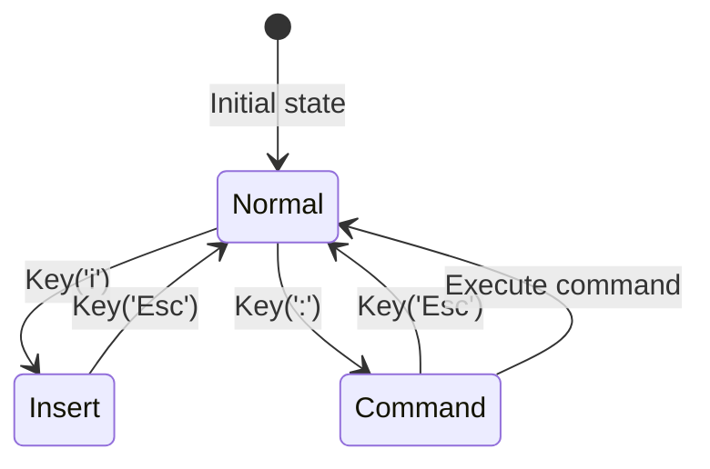

# BP-INPUT-ROUTER-001: Input Event Router

## BP-1: Design Overview

### System Purpose
Routes input events from winit to the correct subsystem (Servo, egui, command handler) based on the current modal state (Normal, Insert, Command).

## BP-2: Design Decomposition

| Attribute | Value |
|-----------|-------|
| ID | COMP-INPUT-001 |
| Name | Input Router |
| Type | Module |
| Responsibility | Deterministic event routing based on modal state |

### Rust Module Structure

```
src/input/
├── mod.rs           // Public API
├── mode.rs          // Mode enum and transitions
├── router.rs        // Event routing logic
└── keybindings.rs   // Keybinding registry
```

## BP-4: Traceability

| Requirement ID | Component ID | Yellow Paper Ref |
|----------------|--------------|------------------|
| REQ-MODE-001 | COMP-INPUT-001 | YP-INPUT-MODES-001 DEF-MODE-001 |
| REQ-MODE-002 | COMP-INPUT-001 | YP-INPUT-MODES-001 DEF-MODE-003 |
| REQ-MODE-003 | COMP-INPUT-001 | YP-INPUT-MODES-001 DEF-MODE-003 |
| REQ-MODE-005 | COMP-INPUT-001 | YP-INPUT-MODES-001 THM-MODE-003 |

## BP-5: Interface Design

### IF-INPUT-MODE-001: Mode Management

```rust
#[derive(Debug, Clone, Copy, PartialEq, Eq)]
enum Mode {
    Normal,
    Insert,
    Command,
}

impl InputRouter {
    fn current_mode(&self) -> Mode;
    fn set_mode(&mut self, mode: Mode);
    fn transition(&mut self, event: &KeyEvent) -> Option<Mode>;
}
```

### IF-INPUT-ROUTE-001: Event Routing

```rust
#[derive(Debug, Clone, Copy)]
enum EventDestination {
    Servo,           // Forward to active pane
    Egui,            // Forward to UI framework
    CommandPalette,  // Forward to command palette
    KeybindingHandler, // Execute bound action
    Discard,         // Ignore
}

impl InputRouter {
    fn route_event(&self, event: &winit::event::Event) -> EventDestination;
}
```

### IF-INPUT-KEYBIND-001: Keybinding Registry

```rust
struct KeyCombo {
    modifiers: ModifiersState,
    key: Key,
}

impl KeybindingRegistry {
    fn register(&mut self, mode: Mode, combo: KeyCombo, action: Action);
    fn lookup(&self, mode: Mode, combo: &KeyCombo) -> Option<&Action>;
    fn load_from_lua(&mut self, lua_table: &mlua::Table) -> Result<(), LuaError>;
}
```

**Complexity:**

| Metric | Value | Derivation |
|--------|-------|------------|
| route_event | $O(1)$ | YP-INPUT-MODES-001 LEM-MODE-001 |
| lookup | $O(1)$ expected | YP-INPUT-MODES-001 LEM-MODE-002 |
| register | $O(1)$ amortized | HashMap insert |

## BP-7: Component Design

### Event Routing State Machine



## BP-9: Formal Verification

| Property ID | Description | Method | Priority | Status |
|-------------|-------------|--------|----------|--------|
| PROP-INP-001 | Every event reaches exactly one destination | Lean4 proof | Critical | VERIFIED |
| PROP-INP-002 | Mode transitions are deterministic | Lean4 proof | Critical | VERIFIED |
| PROP-INP-003 | User keybindings override defaults | Unit test | High | PENDING |

**Proof File:** `.specs/02_architecture/proofs/proof_modes.lean`

## BP-12: Quality Checklist
- [x] All BP sections complete
- [x] Traceability to YP-INPUT-MODES-001
- [x] Formal verification specified
