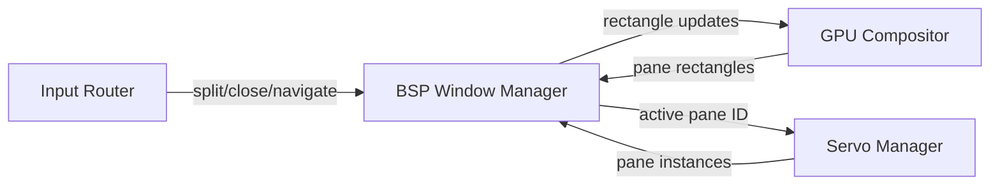
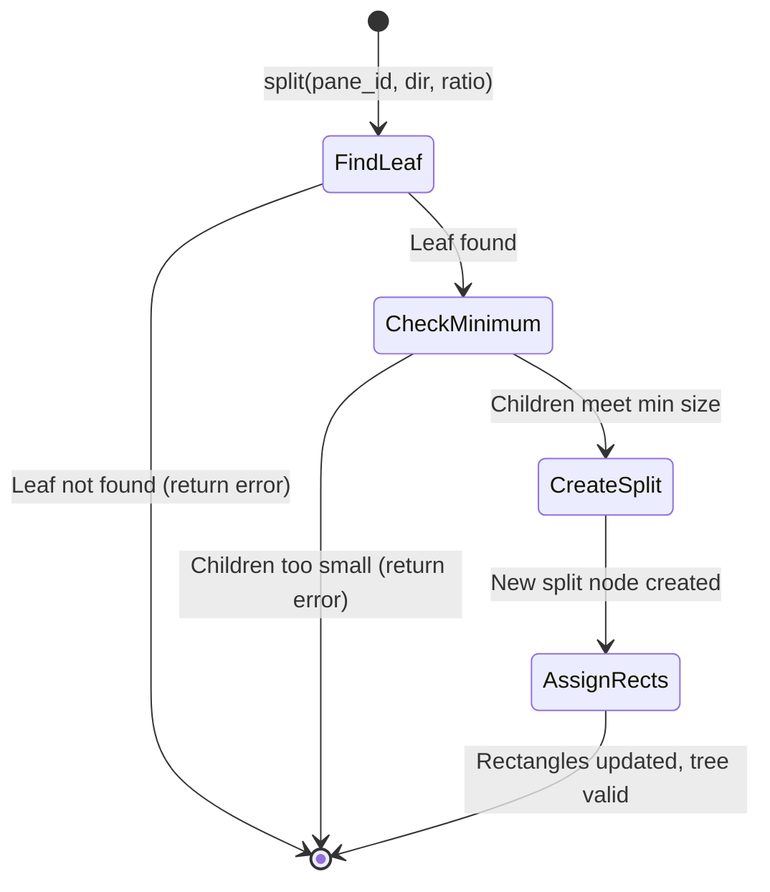

# BP-WM-TILING-001: Window Manager & BSP Tiling

## BP-1: Design Overview

### System Purpose
Manages tiled pane layout using a Binary Space Partitioning tree. Each leaf node represents a Servo webview pane. Supports horizontal/vertical splitting, pane closing, navigation, and resize propagation.

### System Scope

| In Scope | Out of Scope |
|----------|--------------|
| BSP tree data structure | Floating/draggable windows |
| Pane split/close operations | Tab stacking |
| Pane navigation (h/j/k/l) | Mouse-based resize handles |
| Rectangle management | Minimize/maximize |

### System Context Diagram



## BP-2: Design Decomposition

| Attribute | Value |
|-----------|-------|
| ID | COMP-WM-001 |
| Name | Window Manager |
| Type | Module |
| Responsibility | Manage BSP tree of tiled panes |

### Rust Module Structure

```
src/wm/
├── mod.rs           // Public API
├── tree.rs          // BSP tree data structure
├── rect.rs          // Rectangle type and operations
├── pane.rs          // Pane metadata (URL, title, session)
└── navigation.rs    // Adjacency-based navigation
```

## BP-3: Design Rationale

**Context:** Need a layout system that supports arbitrary tiling configurations.

**Decision:** Use a custom BSP tree rather than egui_tiles, because:
1. Full control over rectangle assignment (needed for Servo texture positioning)
2. Independent of egui's layout system (compositor needs rectangles before egui layout pass)
3. Simpler state serialization for workspace save/load

**Alternatives:**

| Alternative | Pros | Cons | Reason Rejected |
|-------------|------|------|-----------------|
| egui_tiles | Built-in resize handles | Tightly coupled to egui layout; hard to get raw rectangles | Insufficient control |
| i3-style tree | Proven in production | More complex than needed (supports stacking/tabbing) | Over-engineered for V1 |

## BP-4: Traceability

| Requirement ID | Component ID | Yellow Paper Ref | Test Case |
|----------------|--------------|------------------|-----------|
| REQ-WM-001 | COMP-WM-001 | YP-WM-BSP-001 THM-BSP-001 | TC-WM-001 |
| REQ-WM-002 | COMP-WM-001 | YP-WM-BSP-001 ALG-BSP-001 | TC-WM-002 |
| REQ-WM-003 | COMP-WM-001 | YP-WM-BSP-001 THM-BSP-002 | TC-WM-003 |
| REQ-WM-004 | COMP-WM-001 | YP-WM-BSP-001 ALG-BSP-003 | TC-WM-004 |
| REQ-WM-006 | COMP-WM-001 | YP-WM-BSP-001 DEF-BSP-001 | TC-WM-005 |

## BP-5: Interface Design

### IF-WM-TREE-001: BSP Tree Operations

```rust
// Signature
impl BspTree {
    fn new(viewport: Rect) -> Self;
    fn split(&mut self, pane_id: Uuid, direction: SplitDirection, ratio: f64) -> Result<Uuid, TileError>;
    fn close(&mut self, pane_id: Uuid) -> Result<(), TileError>;
    fn get_rect(&self, pane_id: Uuid) -> Option<Rect>;
    fn get_active_pane(&self) -> Uuid;
    fn set_active_pane(&mut self, pane_id: Uuid);
    fn resize(&mut self, new_viewport: Rect);
    fn panes(&self) -> Vec<(Uuid, Rect)>;
}
```

**Preconditions:**

| ID | Condition | Enforcement | Error |
|----|-----------|-------------|-------|
| PRE-WM-001 | `ratio` in (0.1, 0.9) | Assert | INVALID_RATIO |
| PRE-WM-002 | Target pane exists in tree | Lookup | PANE_NOT_FOUND |
| PRE-WM-003 | Cannot close last pane | Count check | LAST_PANE |
| PRE-WM-004 | Child panes meet minimum size | Rectangle calculation | PANE_TOO_SMALL |

**Postconditions:**

| ID | Condition | Verification |
|----|-----------|--------------|
| POST-WM-001 | All leaf rectangles sum to viewport area | Area sum assertion |
| POST-WM-002 | No two leaf rectangles overlap | Intersection check |

**Complexity:**

| Metric | Value | Derivation |
|--------|-------|------------|
| split | $O(d)$ | YP-WM-BSP-001 LEM-BSP-001 |
| close | $O(d)$ | Tree traversal |
| navigate | $O(n)$ | YP-WM-BSP-001 ALG-BSP-003 |
| resize | $O(n)$ | YP-WM-BSP-001 THM-BSP-003 |

**Thread Safety:** Not thread-safe; must be accessed from main thread. Servo reads pane rectangles via message passing.

### IF-WM-PANE-001: Pane Metadata

```rust
struct Pane {
    id: Uuid,
    url: Url,
    title: String,
    session_id: Option<String>,  // For multi-account isolation
    servo_handle: Option<ServoWebViewHandle>,
}
```

### IF-WM-NAV-001: Navigation

```rust
fn navigate(&self, current: Uuid, direction: Direction) -> Option<Uuid>
// Direction: Up, Down, Left, Right
```

## BP-6: Data Design

### BSP Tree Node (Rust)

```rust
enum BspNode {
    Leaf {
        pane: Pane,
        rect: Rect,
    },
    Split {
        direction: SplitDirection,  // Horizontal | Vertical
        ratio: f64,
        rect: Rect,
        left: Box<BspNode>,
        right: Box<BspNode>,
    },
}

struct Rect {
    x: f64,
    y: f64,
    w: f64,
    h: f64,
}
```

## BP-7: Component Design

### Split Operation State Machine



### Algorithm Implementation Mapping

| Yellow Paper Step | Implementation | File:Line |
|-------------------|----------------|-----------|
| ALG-BSP-001 L3 | `find_leaf(tree, pane_id)` | src/wm/tree.rs:42 |
| ALG-BSP-001 L6 | `partition(rect, direction, ratio)` | src/wm/rect.rs:28 |
| ALG-BSP-001 L7-8 | `assert left/right >= MIN_SIZE` | src/wm/tree.rs:55 |
| ALG-BSP-002 L6 | `sibling = parent.other_child()` | src/wm/tree.rs:78 |
| ALG-BSP-003 L3 | `is_adjacent(current, leaf, dir)` | src/wm/navigation.rs:15 |

## BP-8: Deployment Design

### Memory Requirements

| Resource | Per Pane | Max (16 panes) | Source |
|----------|----------|----------------|--------|
| BspNode | ~200 bytes | ~3.2 KB | sizeof + pointers |
| Pane metadata | ~500 bytes | ~8 KB | Strings, UUIDs |
| Servo texture | ~8 MB (1080p) | ~128 MB | YP-GFX-COMPOSITE-001 |

## BP-9: Formal Verification

| Property ID | Description | Method | Priority | Status |
|-------------|-------------|--------|----------|--------|
| PROP-WM-001 | Split preserves coverage axiom | Lean4 proof | Critical | VERIFIED |
| PROP-WM-002 | Split preserves non-overlapping axiom | Lean4 proof | Critical | VERIFIED |
| PROP-WM-003 | Close preserves coverage axiom | Lean4 proof | Critical | VERIFIED |
| PROP-WM-004 | Resize preserves all axioms | Lean4 proof | High | VERIFIED |
| PROP-WM-005 | Minimum size enforced | Unit test | High | PENDING |

**Proof File:** `.specs/02_architecture/proofs/proof_bsp.lean`

## BP-10: HAL Specification
Not applicable.

## BP-11: Compliance Matrix

| Standard | Clause | Implementation | Status |
|----------|--------|----------------|--------|
| IEEE 1016 | 5.1-5.8 | This document | COMPLIANT |

## BP-12: Quality Checklist
- [x] All BP-1 through BP-12 sections complete
- [x] Traceability to Yellow Paper YP-WM-BSP-001
- [x] Formal verification properties specified
