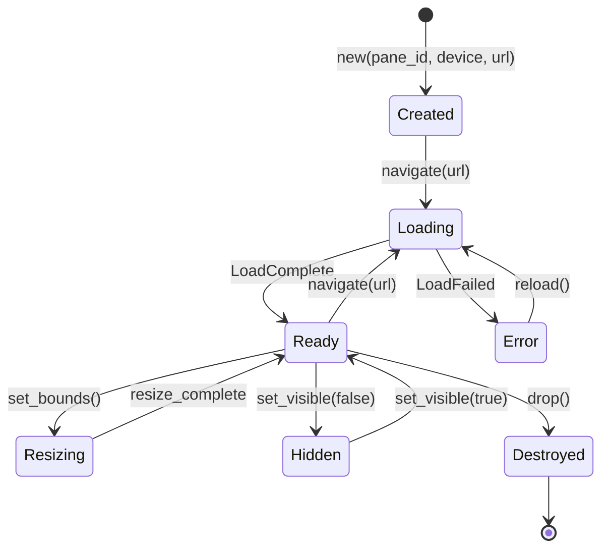
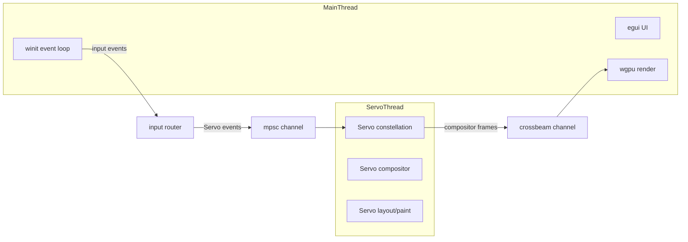
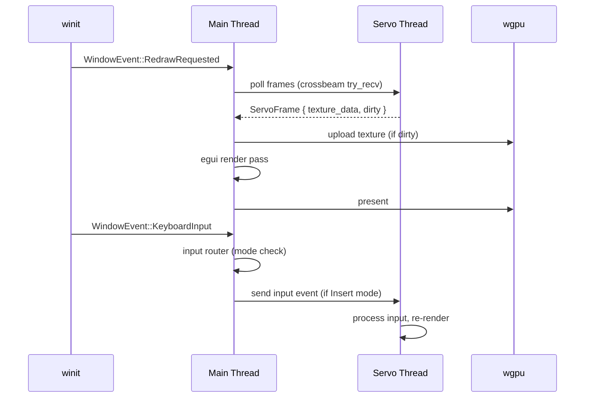
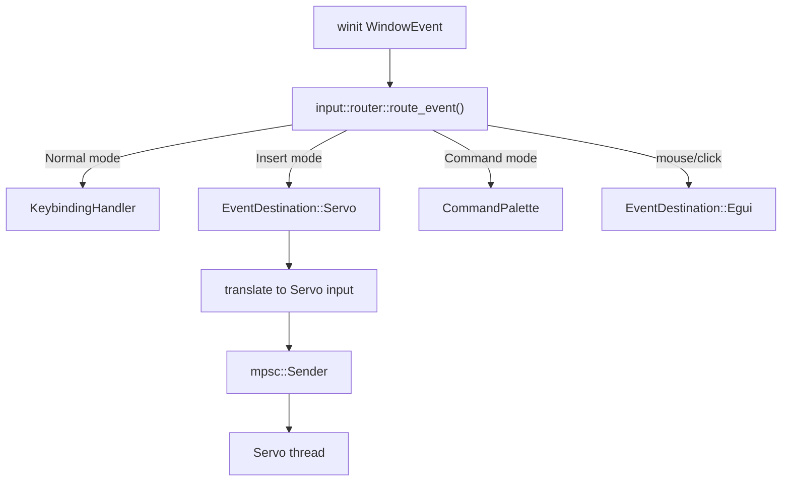
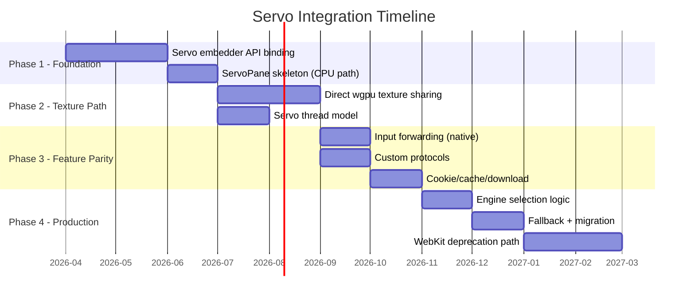

# Servo Pane Architecture Design

**TASK-K30** | Status: Draft | Target: Q3 2026

## Overview

This document specifies how Servo integrates into Aileron as a first-class rendering
engine, replacing the CPU readback bottleneck of Architecture B with direct wgpu
texture rendering (Architecture D).

The existing `PaneRenderer` trait (`src/servo/engine.rs:29`) and the stub
`ServoPane` (`src/servo/servo_engine.rs:19`) define the contract. This design
fills in the implementation.

---

## 1. ServoPane Architecture

### 1.1 Implementation

`ServoPane` implements `PaneRenderer` and wraps Servo's embedder API. Unlike
`WryPane` (which wraps `wry::WebView` and lives on the main thread due to GTK
affinity), `ServoPane` owns a Servo `Embedder` handle and a wgpu texture
produced by Servo's compositor.

```rust
pub struct ServoPane {
    pane_id: Uuid,
    url: Option<Url>,
    title: String,
    servo: ServoEmbedder,
    texture: ServoTexture,
    size: (u32, u32),
    focused: bool,
    event_rx: mpsc::Receiver<ServoEvent>,
}

enum ServoTexture {
    /// Servo rendered into a wgpu texture we own directly.
    WgpuTexture {
        texture: wgpu::Texture,
        view: wgpu::TextureView,
        generation: u64,
    },
    /// DMA-BUF fd imported into wgpu (Linux).
    DmaBuf {
        fd: OwnedFd,
        texture: wgpu::Texture,
        view: wgpu::TextureView,
    },
}

struct ServoEmbedder {
    gl_context: ServoGlContext,
    compositor: ServoCompositor,
}
```

### 1.2 Internal State Management

```rust
impl ServoPane {
    pub fn new(
        pane_id: Uuid,
        wgpu_device: &wgpu::Device,
        wgpu_queue: &wgpu::Queue,
        servo_instance: &ServoInstance,
        initial_url: &Url,
        width: u32,
        height: u32,
    ) -> Result<Self, ServoError> { ... }
}
```

The `ServoInstance` is a process-wide singleton that manages Servo's global
state (resource threads, constellation channel, font cache). Individual panes
are lightweight and multiplexed through the constellation.

### 1.3 Lifecycle



**Creation**: A `ServoEmbedder` is initialized with an EGL/GL context sharing
the wgpu device's GL context. The initial texture is allocated.

**Navigation**: The URL is sent to Servo's constellation. Servo begins
fetching and layout. Compositor frames arrive asynchronously.

**Resize**: The wgpu texture is recreated at the new dimensions. Servo is
notified of the new viewport size.

**Destruction**: The `ServoEmbedder` sends a close message to the
constellation. The wgpu texture is dropped. Servo releases its resources.

---

## 2. wgpu Texture Sharing Strategy

### 2.1 Option A: Direct wgpu Texture (Recommended)

Servo's compositor renders into a wgpu texture that egui can sample directly.

```rust
fn create_servo_texture(
    device: &wgpu::Device,
    width: u32,
    height: u32,
    format: wgpu::TextureFormat,
) -> (wgpu::Texture, wgpu::TextureView) {
    let texture = device.create_texture(&wgpu::TextureDescriptor {
        label: Some("servo-pane"),
        size: wgpu::Extent3d { width, height, depth_or_array_layers: 1 },
        mip_level_count: 1,
        sample_count: 1,
        dimension: wgpu::TextureDimension::D2,
        format,
        usage: wgpu::TextureUsages::RENDER_ATTACHMENT
             | wgpu::TextureUsages::TEXTURE_BINDING,
        view_formats: &[],
    });
    let view = texture.create_view(&wgpu::TextureViewDescriptor::default());
    (texture, view)
}
```

| Aspect | Assessment |
|--------|-----------|
| Latency | Zero-copy; compositor writes directly to the texture |
| Complexity | Medium -- requires Servo to accept an external wgpu texture ID |
| Platform | Vulkan, Metal, DX12 (all wgpu backends) |
| Risk | Servo's embedder API must expose texture export |

### 2.2 Option B: DMA-BUF Sharing (Linux fallback)

Servo renders to a DMA-BUF, which egui imports via wgpu's `import_memory_fd`.

```rust
fn import_dma_buf(
    device: &wgpu::Device,
    fd: OwnedFd,
    width: u32,
    height: u32,
    format: wgpu::TextureFormat,
) -> wgpu::Texture {
    use wgpu::hal::api::Vulkan;
    // wgpu doesn't expose DMA-BUF import directly yet;
    // use wgpu-hal for platform-specific import
    todo!("requires wgpu-hal DMA-BUF import API")
}
```

| Aspect | Assessment |
|--------|-----------|
| Latency | Near zero-copy (kernel-mediated) |
| Complexity | High -- DRM/KMS integration, format negotiation |
| Platform | Linux only (DRM/KMS) |
| Risk | wgpu DMA-BUF import is experimental; format mismatch possible |

### 2.3 Option C: Shared Memory + CPU Upload (Compatibility fallback)

Servo renders to a pixel buffer; Aileron uploads it to wgpu each frame.

This is what Architecture B already does via `OffscreenWebView::capture_frame()`
(`src/offscreen_webview.rs:349`). It costs ~5-8ms per pane per frame due to
`get_pixbuf()` + BGRA-to-RGBA conversion + `queue.write_texture()`.

| Aspect | Assessment |
|--------|-----------|
| Latency | 5-8ms CPU overhead per pane per frame |
| Complexity | Low -- same pattern as current offscreen rendering |
| Platform | Any |
| Risk | None -- well-understood fallback |

### 2.4 Recommendation

Use **Option A** as primary. Fall back to **Option C** if the Servo embedder
API does not support external texture export at launch. **Option B** can be
added later as a Linux-specific optimization once wgpu's DMA-BUF story matures.

```rust
enum TextureBackend {
    DirectWgpu(ServoTexture),
    CpuUpload {
        pixels: Vec<u8>,
        texture: wgpu::Texture,
        view: wgpu::TextureView,
    },
}
```

---

## 3. Thread Model

### 3.1 Option A: Same Thread

Servo runs its event loop on the main thread, interleaved with winit/egui.

| Pro | Con |
|-----|-----|
| Simple data flow, no synchronization | Servo layout/paint blocks the UI thread |
| Easy access to wgpu device/queue | Jank during heavy page loads |

### 3.2 Option B: Dedicated Thread (Recommended)

Each Servo pane runs on its own thread. Communication uses channels.



| Pro | Con |
|-----|-----|
| UI never blocked by page rendering | Channel latency (~microseconds) |
| Parallel rendering for multiple panes | Texture must cross thread boundary |
| Matches Servo's own threading model | Slightly more complex |

### 3.3 Option C: Thread Pool

Multiple Servo instances share a thread pool via work-stealing.

| Pro | Con |
|-----|-----|
| Efficient resource use under high pane count | Servo embedder is not designed for this |
| | Oversubscription risk |

### 3.4 Recommendation

**Option B: Dedicated thread per Servo pane.** This matches Servo's own
architecture (constellation runs on a separate thread). The channel overhead
is negligible compared to the rendering savings from avoiding CPU readback.

```rust
struct ServoThread {
    handle: std::thread::JoinHandle<()>,
    command_tx: mpsc::Sender<ServoCommand>,
    frame_rx: crossbeam_channel::Receiver<ServoFrame>,
}

enum ServoCommand {
    Navigate(Url),
    Resize { width: u32, height: u32 },
    SendInput(InputEvent),
    ExecuteJs(String),
    Reload,
    Back,
    Forward,
    Shutdown,
}

struct ServoFrame {
    texture_data: FrameData,
    dirty: bool,
}
```

---

## 4. Event Loop Integration

### 4.1 Architecture

Aileron uses winit's `EventLoop` with `ControlFlow::Wait`. Servo does not have
its own event loop in the embedder API -- it runs as a set of tasks driven by
messages.



### 4.2 Wake-Up Mechanism

Servo signals new frames via a `crossbeam_channel::Receiver` that the main
thread polls during `about_to_wait`. If a frame is ready, the main thread calls
`window.request_redraw()`.

```rust
fn about_to_wait(&mut self) {
    // Poll Servo frames
    for pane in self.servo_panes.iter_mut() {
        while let Ok(frame) = pane.frame_rx.try_recv() {
            pane.handle_frame(frame);
            self.window.request_redraw();
        }
    }
}
```

### 4.3 Priority Handling

1. **winit input events** are processed first (highest priority).
2. **Servo frame data** is polled (non-blocking).
3. **egui layout + render** runs last.

Servo thread work is async and never blocks the main thread. If Servo is slow
to produce a frame, the previous frame is reused (no jank).

---

## 5. Input Forwarding

### 5.1 Event Flow

The existing `EventDestination` enum (`src/input/router.rs:4`) already routes
events to `Servo`. For `ServoPane`, the flow is:



In Insert mode, keyboard events are translated to `ServoCommand::SendInput`
and forwarded to the Servo thread via the command channel. This replaces the
current JavaScript-based forwarding in `OffscreenWebView::forward_key_event()`
(`src/offscreen_webview.rs:451`).

### 5.2 Focus Management

Focus state is tracked per-pane in `AppState`:

```
Mode::Insert  --> focused pane receives input
Mode::Normal  --> no pane receives input (egui handles mouse)
Mode::Command --> command palette has focus
```

When entering Insert mode, `ServoCommand::Focus` is sent to the active pane.
When exiting, `ServoCommand::Unfocus` is sent.

### 5.3 Shortcut Conflicts

The existing mode system resolves conflicts:

- **Normal mode**: All keys go to keybinding handler. No web shortcuts active.
- **Insert mode**: `Escape` returns to Normal. All other keys go to Servo.
  Web page shortcuts (Ctrl+C, Ctrl+V, Ctrl+T, etc.) pass through to Servo.
- **Command mode**: All keys go to command palette.

No additional shortcut suppression is needed. The mode boundary is the
conflict resolution mechanism.

### 5.4 Mouse and Scroll Events

Mouse events in Insert mode are forwarded to Servo for hit-testing and
interaction. Scroll events use `ServoCommand::ScrollBy { dx, dy }` for smooth
native scrolling (replacing the JS `window.scrollBy` approach in
`OffscreenWebView::scroll_by()`).

---

## 6. Resource Loading

### 6.1 Custom Protocol Handler

Servo supports custom scheme handlers via its embedder API. The `aileron://`
protocol pages (`aileron://welcome`, `aileron://new`, `aileron://files`,
`aileron://settings`, `aileron://error`) are registered as a custom scheme.

```rust
fn register_custom_protocols(embedder: &mut ServoEmbedder) {
    embedder.register_scheme("aileron", |request| {
        let path = request.uri().path().trim_start_matches('/');
        let html = match path {
            "welcome" => aileron_welcome_page(),
            "new" => aileron_new_tab_page(),
            "files" => file_browser_page(request.uri()),
            "settings" => aileron_settings_page(),
            "error" => error_page(request.uri()),
            _ => aileron_welcome_page(),
        };
        Response::builder()
            .header("Content-Type", "text/html")
            .body(html.into_bytes())
            .unwrap()
    });
}
```

The HTML generators are reused from `src/servo/wry_engine.rs` (the
`aileron_welcome_page()`, `aileron_new_tab_page()`, etc. functions at lines
903-1372).

### 6.2 Cookie Management

Servo's cookie jar is per-constellation (shared across panes by default).
Aileron can configure per-site cookie policies via the site settings database
(`src/db/site_settings.rs`). Cookie clearing uses Servo's API rather than
JavaScript (`document.cookie`).

### 6.3 Cache Management

Servo has its own HTTP cache. Aileron can clear it via the Servo embedder API.
Cache size limits are configurable per the Servo instance settings.

### 6.4 Download Handling

Servo's embedder API provides download callbacks. Aileron routes downloads
to the user's `~/Downloads/` directory and records them in the downloads
database (`src/db/downloads.rs`), mirroring the current `WryEvent::DownloadStarted`
handling in `wry_engine.rs:371`.

---

## 7. Engine Selection Logic

### 7.1 Configuration

A new `engine_selection` field is added to `Config` (`src/config.rs`):

```toml
# Engine selection: "auto", "servo", "webkit"
engine_selection = "auto"

# Per-site overrides: domain -> engine
[engine_overrides]
"docs.rs" = "servo"
"example.com" = "webkit"
```

```rust
// In Config
pub engine_selection: String,  // "auto", "servo", "webkit"
pub engine_overrides: HashMap<String, String>,  // domain -> engine
```

### 7.2 Auto-Selection Heuristics

When `engine_selection = "auto"`, the engine is chosen per-navigation:

```rust
fn select_engine(url: &Url, config: &Config) -> EngineType {
    // 1. Check per-site override
    if let Some(host) = url.host_str() {
        if let Some(engine) = config.engine_overrides.get(host) {
            return match engine.as_str() {
                "servo" => EngineType::Servo,
                _ => EngineType::WebKit,
            };
        }
    }

    // 2. Internal pages always use Servo
    if url.scheme() == "aileron" {
        return EngineType::Servo;
    }

    // 3. Default: WebKit (stable, full compat)
    EngineType::WebKit
}
```

Initially, auto-selection defaults to WebKit for all external pages. As Servo
compatibility improves, the heuristic can be expanded (e.g., prefer Servo for
simple text pages, documentation sites).

### 7.3 Fallback on Failure

If Servo fails to render a page (crash, unsupported feature), the pane is
migrated to WebKit:

```rust
fn handle_servo_failure(pane: &mut ServoPane, url: &Url) {
    warn!("Servo failed for {}, falling back to WebKit", url);
    let wry_pane = WryPane::new(/* ... */).unwrap();
    // Replace pane in manager
}
```

The `EngineType` in `PaneState` is updated to `WebKit` so subsequent
navigations in that pane continue using WebKit.

### 7.4 Per-Site Override Commands

```
:engine servo          -- switch current pane to Servo
:engine webkit         -- switch current pane to WebKit
:engine auto           -- restore auto-selection
:set engine servo      -- set global default to Servo
```

These commands are handled in `AppState::execute_command()` alongside the
existing `:engine` command at `src/app/mod.rs:1701`.

---

## 8. Migration Path

### 8.1 Incremental Steps



### 8.2 Phase Details

**Phase 1 -- Foundation**: Add the `servo` crate dependency. Implement
`ServoPane` with CPU upload (Option C from section 2). This reuses the
`FrameData` struct from `src/offscreen_webview.rs:26` and the BGRA-to-RGBA
pipeline. Verify correctness against the existing offscreen rendering path.

**Phase 2 -- Texture Path**: Replace CPU upload with direct wgpu texture
sharing (Option A). Move Servo to a dedicated thread (Option B from section 3).

**Phase 3 -- Feature Parity**: Implement native input forwarding (replacing
JS-based forwarding). Register custom protocols. Implement cookie/cache/download
management via Servo APIs.

**Phase 4 -- Production**: Add engine selection config. Implement fallback
from Servo to WebKit on failure. Begin deprecating the wry/WebKit path.

### 8.3 Testing Strategy

1. **Unit tests**: `ServoPane` methods tested against a mock Servo embedder.
   Verify `navigate`, `set_bounds`, `execute_js`, etc.
2. **Integration tests**: Launch Aileron with `engine_selection = "servo"`,
   navigate to known pages, verify texture output matches expected pixels.
3. **Comparison tests**: Render the same page with both engines, compare
   screenshots using perceptual hashing (SSIM > 0.95 threshold).
4. **Fuzz tests**: Feed malformed URLs, oversized pages, and rapid resize
   sequences to `ServoPane` to verify no panics or memory leaks.
5. **Performance benchmarks**: Compare frame time (Architecture B vs D)
   using the existing `benches/benchmarks.rs` harness.

### 8.4 Rollback Plan

- The `engine_selection = "webkit"` config option forces WebKit for all
  pages, bypassing Servo entirely.
- `ServoPane` is behind a feature flag: `#[cfg(feature = "servo")]`.
- If a Servo pane crashes, the fallback logic (section 7.3) migrates it to
  WebKit mid-session.
- The `WryPane` / `OffscreenWebView` code paths remain untouched and
  functional throughout the migration.

---

## Appendix: Key File References

| File | Role |
|------|------|
| `src/servo/engine.rs:29` | `PaneRenderer` trait definition |
| `src/servo/servo_engine.rs:19` | Current `ServoPane` stub |
| `src/servo/wry_engine.rs:43` | `WryPane` (reference implementation) |
| `src/offscreen_webview.rs:42` | `OffscreenWebView` (Architecture B) |
| `src/input/router.rs:20` | `route_event()` -- input destination |
| `src/input/mode.rs:5` | `Mode` enum (Normal/Insert/Command) |
| `src/gfx/renderer.rs:7` | `GfxState` -- wgpu device/queue/surface |
| `src/config.rs:16` | `Config` struct |
| `src/app/mod.rs:80` | `AppState` -- pane management, action dispatch |
| `src/wm/pane.rs:6` | `Pane` metadata struct |
