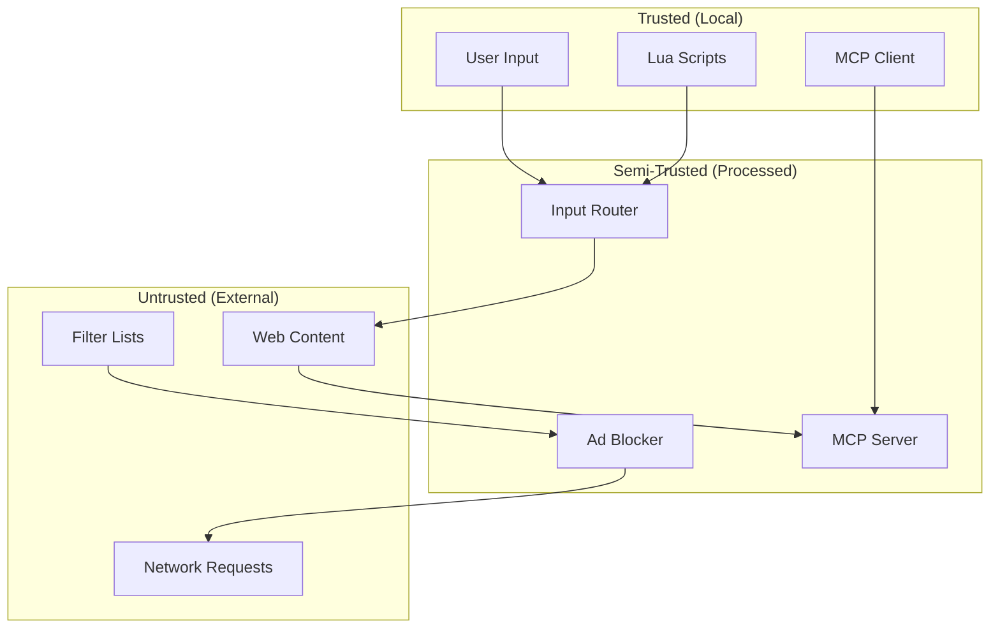

# STRIDE Threat Model — Aileron

## Threat Model Summary

| Category | Threat ID | Threat Description | Severity | Mitigation |
|----------|-----------|-------------------|----------|------------|
| **S**poofing | T-SPOOF-001 | MCP client impersonation | High | Local-only transport + optional token auth |
| **T**ampering | T-TAMP-001 | Malicious init.lua executes arbitrary Rust via FFI | Critical | Sandbox Lua; restrict FFI access |
| **T**ampering | T-TAMP-002 | Filter list file tampering | Medium | Verify file checksums on load |
| **R**epudiation | T-REPU-001 | No audit log of MCP tool invocations | Low | Optional audit logging to file |
| **I**nformation Disclosure | T-INFO-001 | Password values leaked in logs/traces | Critical | Never log credential values; use tracing filters |
| **I**nformation Disclosure | T-INFO-002 | MCP server exposes full DOM including sensitive forms | High | Sanitize DOM before MCP export; redact password fields |
| **I**nformation Disclosure | T-INFO-003 | Browsing history accessible to other users | Medium | Encrypt SQLite database at rest |
| **D**enial of Service | T-DOS-001 | Malicious website causes Servo to consume excessive memory | High | Per-pane memory limits; OOM kill recovery |
| **D**enial of Service | T-DOS-002 | MCP client floods tool requests | Medium | Rate limiting on MCP server |
| **E**levation of Privilege | T-ELEV-001 | JS injection (password manager) grants access to other panes | High | Isolate JS execution per pane; no cross-pane JS |
| **E**levation of Privilege | T-ELEV-002 | MCP tool `run_js` executes arbitrary code | High | Require explicit user confirmation for `run_js` |

## Attack Surface Analysis

### Entry Points

| Entry Point | Type | Trust Level | Attack Vectors |
|-------------|------|-------------|----------------|
| winit keyboard/mouse events | Input | High (local user) | Keylogger, input injection |
| Servo web content rendering | Network | Low (arbitrary web) | XSS, malicious JS, drive-by download |
| MCP server (stdio/SSE) | IPC | Medium (local AI client) | Tool injection, data exfiltration |
| Lua init.lua scripts | Filesystem | Medium (user-configured) | Arbitrary code execution |
| SQLite database | Filesystem | High (local) | Database injection, file tampering |
| Filter list files | Filesystem | Medium (downloaded) | Malicious filter rules |
| Password manager CLI | Process | High (local CLI) | Process impersonation |
| HTTP/HTTPS network requests | Network | Low (arbitrary) | MITM, malicious responses |

### Trust Boundaries

## Detailed Threat Analysis

### T-INFO-001: Credential Leakage in Logs

**Severity:** Critical
**Affected Components:** Password Manager, Logging (tracing)
**Description:** When the password manager injects credentials into a web page, the password value could be logged by the tracing subsystem, exposing it in log files.

**Mitigation:**
1. Implement a `SensitiveString` wrapper type that never implements `Display` or `Debug`
2. Use `tracing::Span` with `secret = true` attribute to prevent value logging
3. Zeroize credential memory after DOM injection (using `zeroize` crate)

**Verification:** Audit all tracing calls for credential values; use `grep` on log output.

### T-INFO-002: MCP DOM Exposure

**Severity:** High
**Affected Components:** MCP Server, DOM-to-Markdown converter
**Description:** The `read_active_pane` tool extracts full DOM content. If the user is on a banking site or password page, sensitive data (account numbers, passwords) could be sent to the AI client.

**Mitigation:**
1. Sanitize DOM: Remove `<input type="password">` values before Markdown conversion
2. Remove form fields with `autocomplete="off"` or financial class names
3. Add a `sensitive_mode` flag that the user can toggle per-pane
4. Log a warning when MCP reads from HTTPS pages with forms

### T-ELEV-001: Cross-Pane JS Injection

**Severity:** High
**Affected Components:** Servo Integration, Password Manager
**Description:** If `run_js` or password injection executes in the wrong pane context, it could access cookies or DOM of other panes (different sessions).

**Mitigation:**
1. Each Servo webview has isolated JS execution context
2. JS injection always targets the specific pane by ID
3. Servo's Embedder API ensures per-pane script contexts

### T-TAMP-001: Malicious Lua Scripts

**Severity:** Critical
**Affected Components:** Lua Engine
**Description:** A malicious `init.lua` could use `mlua`'s FFI capabilities to execute arbitrary system commands or access files.

**Mitigation:**
1. Do NOT enable `mlua` feature `luajit` (JIT can bypass sandboxing)
2. Restrict Lua standard library: disable `os.execute`, `io.open`, `require`
3. Provide a safe API surface: only expose `aileron.*` namespace
4. Run Lua in a dedicated thread with reduced permissions

## Security Requirements Mapping

| OWASP Category | Aileron Requirement | Mitigation |
|----------------|--------------------|----|
| A01: Broken Access Control | REQ-SEC-003 (MCP auth) | Token-based auth for MCP |
| A02: Cryptographic Failures | REQ-SEC-004 (Session isolation) | Per-pane cookie isolation |
| A03: Injection | REQ-SEC-002 (JS injection safety) | Per-pane isolation |
| A04: Insecure Design | T-INFO-002 (DOM sanitization) | Sensitive field redaction |
| A05: Security Misconfiguration | Filter list loading | Checksum verification |
| A07: Auth Failures | MCP server auth | Local token exchange |
| A08: Data Integrity | Filter list tampering | SHA-256 verification |
| A09: Logging Failures | REQ-SEC-001 (No credential logs) | SensitiveString type |
| A10: SSRF | MCP search_web tool | URL whitelist |

## NIST SP 800-53 Control Mapping

| Control Family | Control ID | Description | Implementation |
|----------------|-----------|-------------|----------------|
| AC (Access Control) | AC-3 | Least Privilege | Lua sandboxing, MCP auth |
| AU (Audit) | AU-2 | Audit Events | Optional MCP audit log |
| CM (Configuration) | CM-2 | Baseline Config | Default secure config |
| IA (Identification) | IA-2 | User Identification | MCP token auth |
| SC (System & Comms) | SC-7 | Boundary Protection | Trust boundaries enforced |
| SC (System & Comms) | SC-8 | Transmission Confidentiality | Local-only MCP transport |
